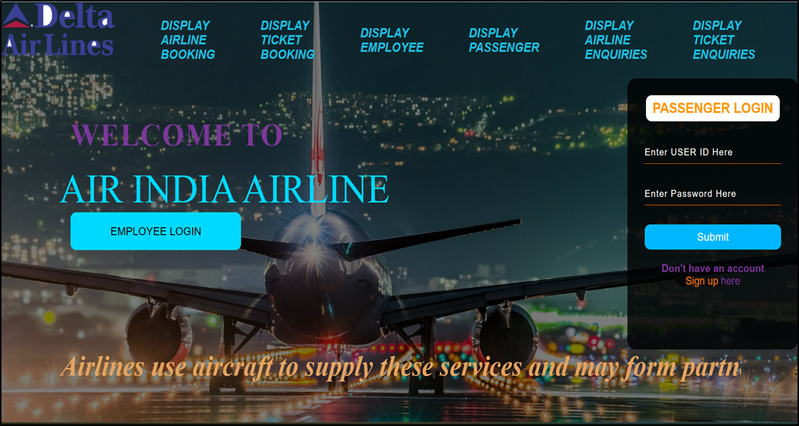
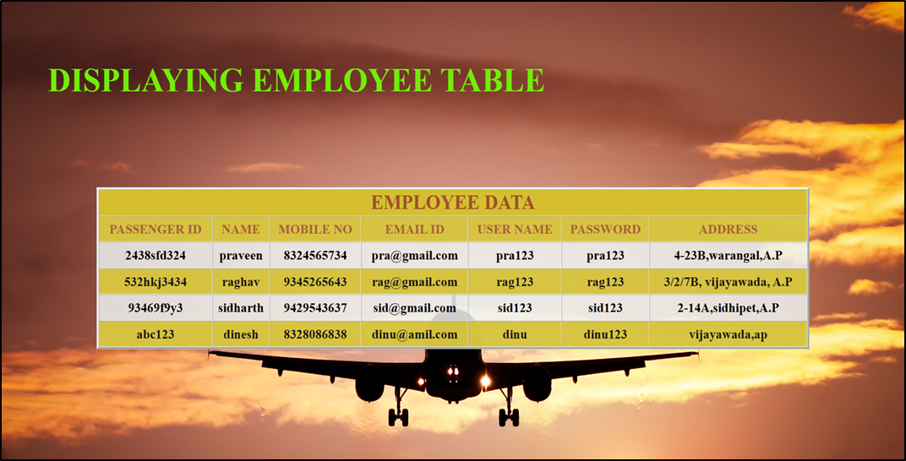
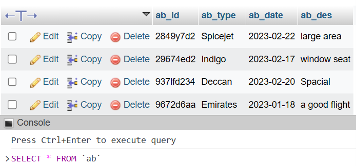

# Airport Database Management System

## Project Overview
This project is an Airport Database Management System designed to manage various aspects of airport operations, including airline booking, employee management, and enquiry handling. The system includes both front-end and back-end components, utilizing HTML, CSS, MariaDB, and PHP.

## Technology Stack

### Software
- *Front-end*: HTML, CSS
- *Back-end*: MariaDB
- *Connecting Bridge*: PHP (Hypertext Preprocessor)

## Database Schema
The project involves the creation of several tables in MariaDB, each designed to store specific data related to airport operations.

### Tables and Attributes
1. *Airline Booking Table*
   - SSN (Foreign Key referencing Technician)
   - u_num (Primary Key)
  
2. *Login Table*
   - Username (Primary Key)
   - Password
  
3. *Model Table*
   - Model_no (Primary Key)
   - Weight
   - Capacity
   - Reg_no (Foreign Key referencing Plane Table)
  
4. *Plane Table*
   - Reg_no (Primary Key)
   - FAA_no (Foreign Key referencing Test Table)
   - SSN (Foreign Key referencing Technician Table)
  
5. *Technician Table*
   - Name
   - Street
   - Area
   - Salary
   - Doorno
   - SSN (Primary Key)
  
6. *Test Table*
   - Name
   - Score
   - FAA_NO (Primary Key)
  
7. *Test_info Table*
   - Hours
   - Date
   - Score
   - FAA_NO (Foreign Key referencing Plane Table)
   - SSN (Foreign Key referencing Technician Table)
   - Reg_no (Foreign Key referencing Plane Table)
  
8. *Traffic_control Table*
   - SSN (Foreign Key referencing Technician Table)
   - Date
  
9. *Model_tech Table*
   - Model_no (Foreign Key referencing Model Table)
   - SSN (Foreign Key referencing Technician Table)
  
10. *Tech_phn Table*
    - Phnno1
    - Phnno2
    - SSN (Foreign Key referencing Technician Table)

## System Features
- *User Authentication*: Users can sign up and log in to access various services like ticket booking, cancellation, and enquiries.
- *Airline Booking*: Users can book flights, and the details are stored and managed in the database.
- *Enquiry Handling*: Users can submit enquiries, and these are tracked and managed through a dedicated table.
- *Employee Management*: Employees can enter and manage their details, which are stored in the back-end database.

## Project Results
The project successfully integrates the front-end and back-end components to provide a seamless experience for both users and administrators. All user interactions are reflected in the database, and operations like booking, enquiries, and employee management are efficiently handled.

## Conclusion
The Airport Database Management System was developed using technologies familiar to the team. While the current version covers core functionalities, there is potential for future enhancements, such as expanding employee and plane data entries.